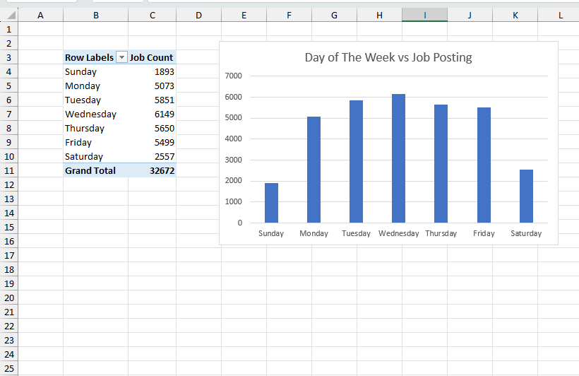

# 📅 Job Posting Trends by Day of the Week (2023)

## 📊 Project Overview
This analysis explores **how job posting activity varies across different days of the week** using global job market data from **2023**.

The dataset was **cleaned and transformed using Power Query** and analyzed using **Pivot Tables and Pivot Charts** in Microsoft Excel.  
A **bar/column chart** is used to visualize the relationship between **day of the week and job posting count**, helping identify patterns in recruiter posting behavior.

This project demonstrates practical **data analysis and visualization skills** relevant to a Data Analyst role.

---

## 📸 Visualization Preview

  

---

## 🎯 Objectives
- Analyze **job posting frequency by day of the week**
- Identify **peak and low job posting days**
- Understand employer posting behavior patterns
- Present insights using a **clear and simple visualization**

---

## 📁 Dataset Details
- **Time Period:** January 01, 2023 – December 31, 2023
- **Coverage:** Global job postings
- **Key Fields:**
  - Posting Date
  - Day of the Week
  - Job Count

---

## 🛠 Tools & Technologies
- **Microsoft Excel**
  - Power Query – Data cleaning and transformation
  - Pivot Tables
  - Pivot Charts (Bar / Column Chart)
- Data Analysis & Reporting

---

## 📈 Visualization Details
- **Chart Type:** Bar / Column Chart
- **X-Axis:** Day of the Week (Monday–Sunday)
- **Y-Axis:** Job Posting Count

This visualization makes it easy to compare **job posting volume across weekdays** and identify trends at a glance.

---

## 🔍 Key Insights
- Highlights which **days have the highest job posting activity**
- Reveals **weekly patterns** in recruitment behavior
- Useful for:
  - Job seekers optimizing application timing
  - Recruiters planning posting schedules
  - Workforce and labor market analysis

---

## 📌 Skills Demonstrated
- Data cleaning and preparation using Power Query
- Time-based aggregation and analysis
- Pivot table creation
- Effective data visualization
- Business-focused insight generation

---

## 🚀 How to Use
1. Download and open the Excel workbook
2. Navigate to the Pivot Chart sheet
3. Review the bar/column chart showing job count by weekday
4. Use insights to understand weekly job posting trends

---

## 📬 Contact
For questions, feedback, or discussion about this project or data analyst opportunities, feel free to connect.
