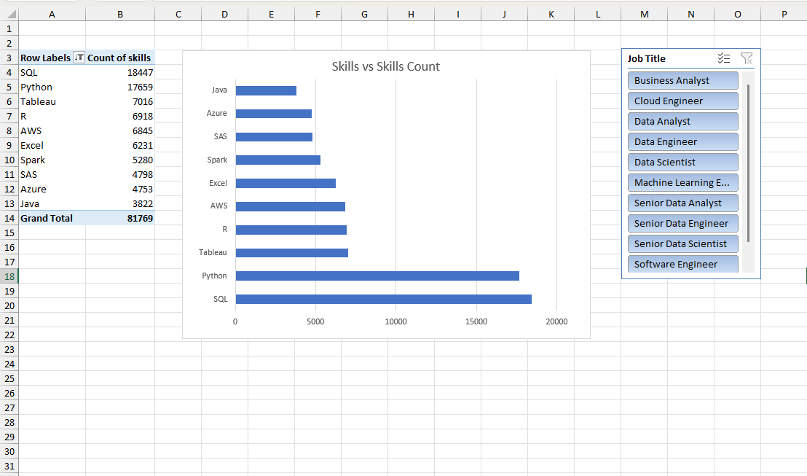

# 🌍 Global Job Market Skills Analysis (2023)

## 📊 Project Overview
This project analyzes global job listings from **January 1, 2023 to December 31, 2023** to understand **job roles and the skills associated with them** across different regions of the world.

The dataset was **cleaned and transformed using Power Query**, and insights were visualized using **Excel Pivot Tables and Bar Charts**. The workbook allows users to **interactively explore how different job titles are associated with specific skills and skill counts**.

---

## 📸 Dashboard Preview

  

---

## 🎯 Objectives
- Analyze global job titles for the year 2023  
- Identify skills associated with each job role  
- Measure and compare skill demand using skill counts  
- Enable interactive analysis using Pivot Table filters  

---

## 📁 Dataset Details
- **Time Period:** Jan 01, 2023 – Dec 31, 2023  
- **Coverage:** Worldwide job listings  
- **Key Fields:**
  - Job Title  
  - Skills  
  - Skill Type  
  - Skill Count  
  - Location  

---

## 🛠 Tools & Technologies
- **Microsoft Excel**
  - Power Query (Data Cleaning & Transformation)
  - Pivot Tables
  - Bar Chart Visualizations
- Data Analysis & Reporting  

---

## 📈 Key Features
- Cleaned and structured dataset using **Power Query**
- Interactive **Pivot Tables** for job title and skill analysis
- **Bar Charts** showing skill counts by job title
- Users can filter by:
  - Job Title
  - Skill Type  

---

## 🔍 Insights & Analysis
- Highlights the most common job roles worldwide  
- Shows how each job title is associated with different skills  
- Compares skill demand using skill counts  
- Enables customized analysis by changing job title selections  

---

## 🚀 How to Use
1. Download and open the Excel workbook  
2. Navigate to the Pivot Table or Dashboard sheet  
3. Use filters or slicers to select a job title  
4. Analyze the bar charts to view associated skills and skill counts  

---

## 📌 Future Enhancements
- Add salary-based analysis  
- Include country-level comparisons  
- Create trend analysis over time  
- Upgrade visuals to Power BI or Tableau  
