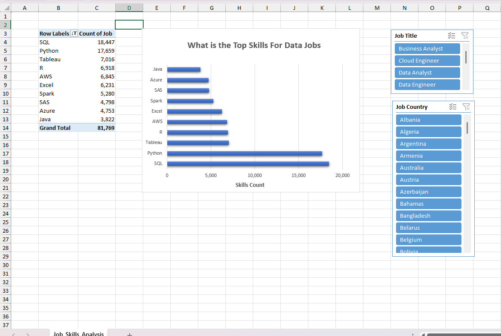

# 🌍 Global Job Market Skills Demand Analysis (2023)

## 📊 Project Overview
This project analyzes **global job market data for 2023** to understand **skill demand across different job roles and countries**.

The data was **cleaned and transformed using Power Query** and modeled using **Power Pivot** to enable efficient aggregation and interactive analysis.  
Insights are presented through **Pivot Tables and Bar Charts**, allowing users to explore **job count distribution by skill** using dynamic slicers.

This project demonstrates practical **Excel-based data analysis skills** aligned with real-world data analyst responsibilities.

---

## 📸 Dashboard Preview

  

---

## 🎯 Objectives
- Analyze **job demand by skill**
- Understand how **skill demand varies by job title**
- Compare **job counts across countries**
- Enable **interactive exploration** using slicers
- Provide clear, visual insights for data-driven decision-making

---

## 📁 Dataset Details
- **Time Period:** January 01, 2023 – December 31, 2023
- **Coverage:** Global job listings
- **Key Fields:**
  - Job Title
  - Skill
  - Job Count
  - Country

---

## 🛠 Tools & Technologies
- **Microsoft Excel**
  - **Power Query** – Data cleaning and transformation
  - **Power Pivot** – Data modeling and aggregation
  - **Pivot Tables & Pivot Charts**
  - **Slicers** – Interactive filtering
- **Data Analysis & Reporting**

---

## 📈 Analysis & Visualization
- **Chart Type:** Bar Chart
- **X-Axis:** Job Count
- **Y-Axis:** Skills
- The chart visualizes **job demand for each skill**, making it easy to identify **high-demand skills**.

---

## 🎛 Interactivity
The dashboard includes **two slicers**:
- **Country** – Filter job demand by region
- **Job Title** – Analyze skill requirements for specific roles

Users can freely interact with these slicers to **explore different combinations** and uncover patterns in skill demand.

---

## 🔍 Key Insights
- Identifies **most in-demand skills** across global job markets
- Shows how **skill demand changes by job title**
- Highlights **regional differences** in required skills
- Supports **recruitment, workforce planning, and learning decisions**

---

## 📌 Skills Demonstrated
- ETL using Power Query
- Data modeling with Power Pivot
- Pivot table analysis
- Interactive dashboard design
- Data storytelling and insight generation

---

## 🚀 How to Use
1. Download and open the Excel workbook
2. Go to the **Dashboard** or **Pivot Chart** sheet
3. Use slicers to filter by:
   - Country
   - Job Title
4. Review the bar chart to analyze **skill-wise job demand**

---
