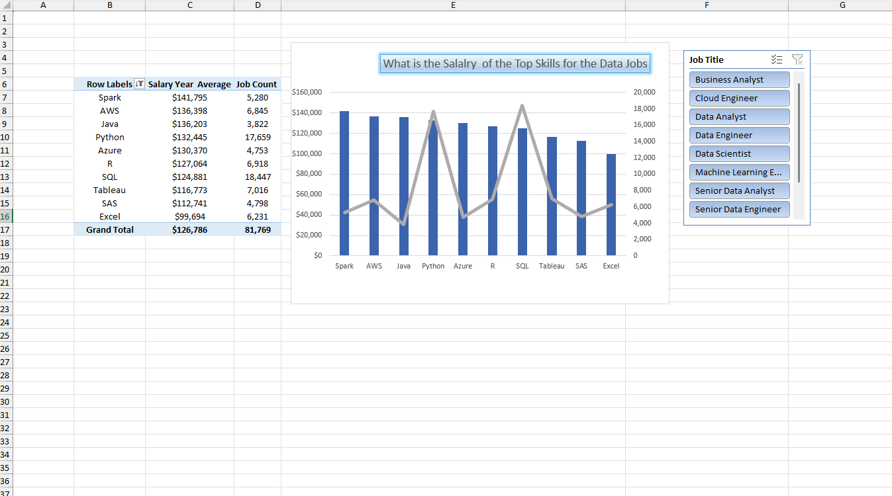

# Job Market Skill-Based Data Analysis – Excel, Power Query & Combo Charts

## 👋 Overview
This project demonstrates my ability to perform **end-to-end data analysis** using **Microsoft Excel**, focusing on **skill-based job market insights**.

The analysis highlights how **job demand and Average  yearly salary vary across technical skills** such as **SQL, Python, Excel, Java, and R**, using a clean ETL process and an interactive dashboard.

This project reflects practical skills expected from a **Data Analyst**, including data transformation, dataset merging, and professional data visualization.

---

## 🎯 Business Objective
The objective of this analysis is to:
- Identify **high-demand technical skills**
- Compare **Average  yearly salaries** across skills
- Understand the relationship between **job demand and salary**
- Provide an **interactive dashboard** for exploration and decision-making

---

## 🛠 Skills Demonstrated
- Data Cleaning & Transformation (ETL)
- Power Query (Advanced)
- Full Outer Join for data integration
- Pivot Tables & Pivot Charts
- Combo Chart (Dual-Axis Visualization)
- Interactive dashboards using slicers
- Analytical thinking and data storytelling

---

## 📊 Data Preparation (ETL Process)
The ETL workflow was implemented using **Power Query**:

1. Imported two monthly datasets:
   - `data_jobs_monthly_reference`
   - `skills_monthly`
2. Cleaned, standardized, and validated the data
3. Performed a **Full Outer Join** to retain all records from both datasets
4. Extracted relevant columns such as:
   - Job skills
   - Job count
   - Average  yearly salary
5. Loaded the transformed data into the Excel data model

This ensures **data accuracy, completeness, and reliability** for analysis.

---

## 📈 Data Visualization & Analysis
The final analysis is presented using a **Combo Chart** built on Pivot Tables.

### Visualization Design
- **Chart Type:** Combo Chart (Column + Line)
- **X-Axis:** Job skills (SQL, Python, Excel, Java, R, etc.)
- **Primary Y-Axis:** Average  yearly salary
- **Secondary Y-Axis:** Job count

This visualization allows viewers to **compare salary levels and job demand simultaneously** for each skill.

---

## 🎛 Interactivity & User Experience
- **Slicers** enable users to dynamically filter the data
- Users can select specific:
  - Skills
  - Time periods (if applicable)
- Charts and metrics update instantly based on selections

This creates a **self-service analytical dashboard**, similar to real-world BI tools.

---

## 📸 Dashboard Preview

  

